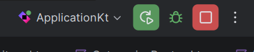

# Océane API (Kotlin Multiplatform + Ktor)

A Océane é uma loja de produtos de beleza. Nesta atividade, foram escolhidos dois models principais: `Product` e `Category`.

Projeto da atividade com:
- API em Ktor (módulo `server`)
- Banco PostgreSQL (via Docker)
- Migrações com Flyway
- Documentação e testes no Swagger


## 1.  Copie o .env-example para um .env na raiz do projeto
- Host: `localhost`
- Porta: `5432`
- Database: `oceane`
- User: `devuser`
- Password: `devpassword`

## 2. Subir o banco de dados

Na raiz do projeto, execute:

```powershell
docker compose up -d
```

## 3. Rodar o servidor

Na parte superior da IDE, selecione o arquivo que eseja executar, nesse caso o `Aplication.kt`, e clique no botão de play.



Ao iniciar, o servidor:
- conecta no PostgreSQL
- executa migrações Flyway automaticamente
- sobe na porta `8080`

## 4. Acessar a API e documentação

- Swagger UI: http://localhost:8080/swagger


## Teste rápido (Swagger)

1. Abrir `/swagger`
2. Criar uma categoria em `POST /categories`
3. Criar produtos em `POST /products` usando o `category_id` criado
4. Testar:
   - `GET /products/category/{categoryId}` (deve listar todos da categoria)
   - `PUT /categories/{id}` e `PUT /products/{id}` com atualização 

